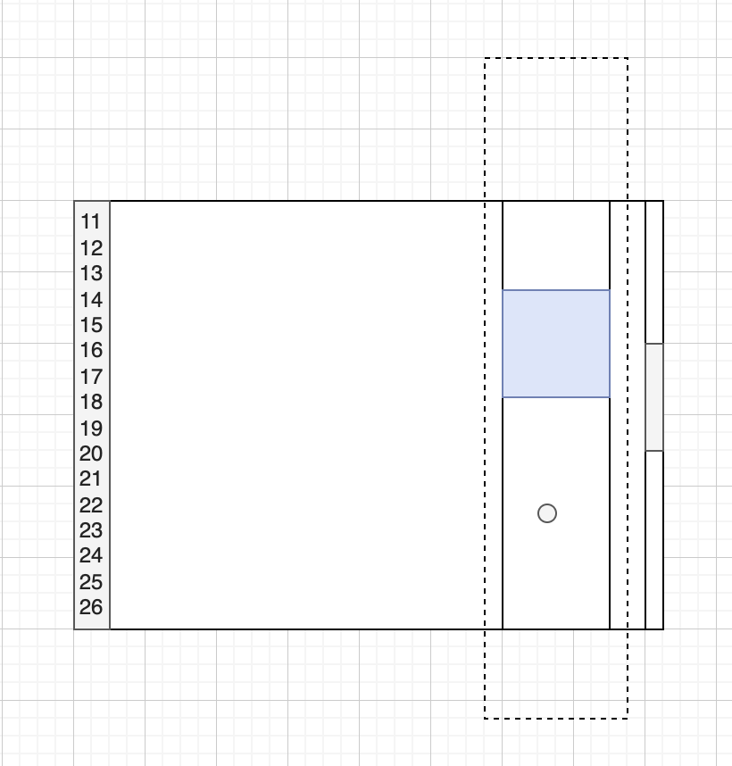
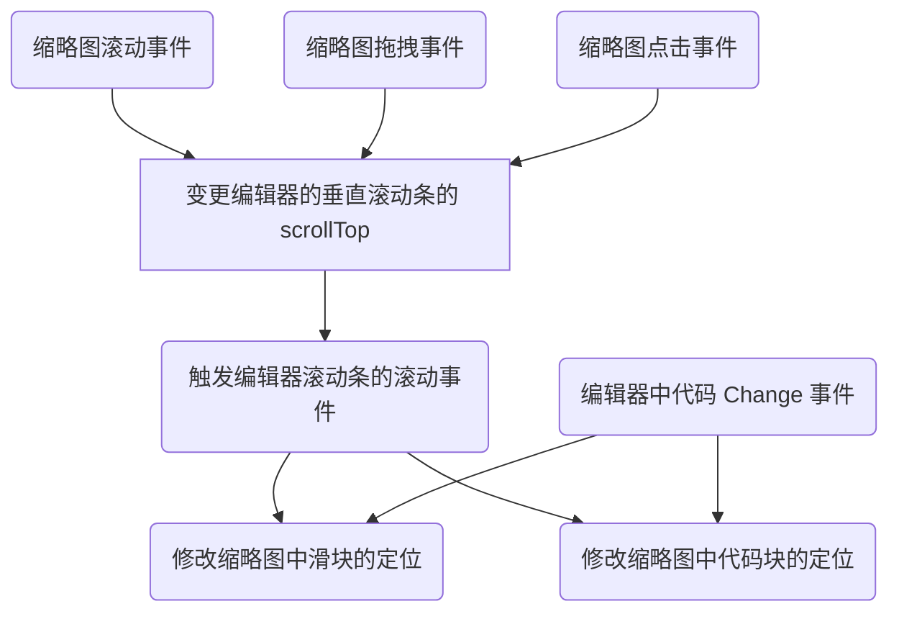

# 编辑器中的缩略图实现原理

# 背景

部分 Web 版的 IDE 编辑器未曾实现缩略图功能，探寻一下缩略图的实现逻辑。以 VSCode 为例。

VSCode 的编辑器是 `mocana`实现的，编辑器的编辑区都是采用的`虚拟渲染`，即仅渲染可视区的代码，可视区之外的动态去除 DOM 节点。

> 打开 VScode > Help > Toggle Developer Tools，观察 DOM 节点的状态变化，可以看到是在动态变化。

# 功能特性

参照 VSCode 的缩略图的能力，功能包括：

1. 滚动。缩略图与编辑器的滚动同步
2. 拖拽。缩略图中的滑块拖拽功能
3. 点击。缩略图的非滑块区域，通过点击操作定位到对应的代码位置

其它的特性：

1. 代码量多的场景下，缩略图中展示的是全量代码中的部分
2. 代码量多的场景下，滚动时，缩略图中的代码与滑块是同时在滚动的

# 方案设计

<b>假设:</b>

- 编辑器的屏高为 1，缩略图中展示的最大代码量为 N 屏的代码，代码总量为 M。
- 能够拿到编辑器的全量代码

整体设计：

## 滚动同步问题

缩略图中滑块移动的百分比 = 缩略图中代码移动的百分比 = Ace Editor 垂直滚动条移动的百分比

六、引用

[^1] <a href="https://ace.c9.io/">https://ace.c9.io/</a>

[^2] <a href="https://github.com/ajaxorg/ace/wiki/Configuring-Ace">https://github.com/ajaxorg/ace/wiki/Configuring-Ace</a>

[^3] <a href="https://marvinsblog.net/post/2022-04-16-web-minimap/">https://marvinsblog.net/post/2022-04-16-web-minimap/</a>

[^4] <a href="https://larsjung.de/pagemap/">https://larsjung.de/pagemap/</a>
