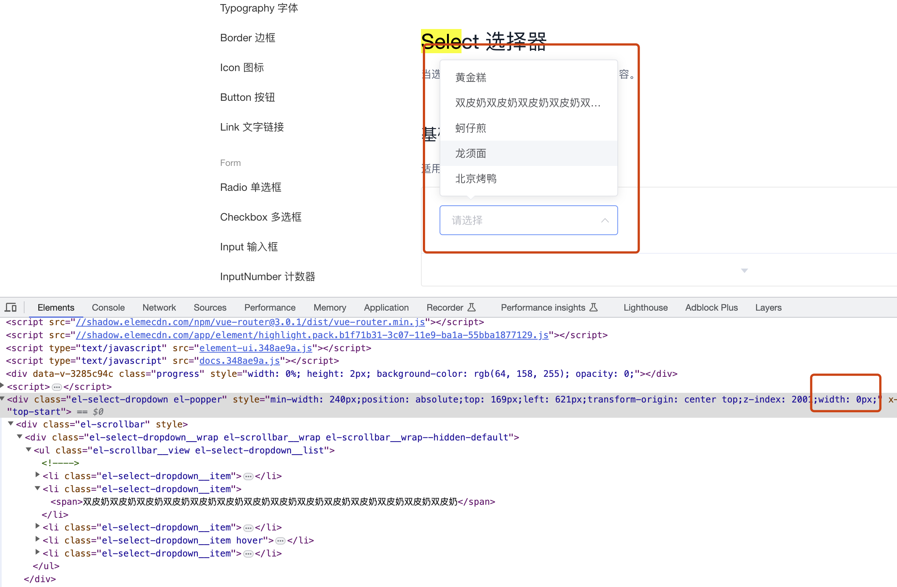

# 宽度问题

# 一、魔法

为 DOM 设置宽度有哪些方式呢？最常用的是配置`width`属性，`width`属性在配置时，也有多种方式：

- width
- min-width
- max-width

通常当配置了 width 时，不会再配置`min-width` `max-width`，如果将这三者混合使用，会有什么魔法效果呢？

测试代码：

```html
<style>
  .box {
    display: inline-block;
    border: 1px solid #e8e8e8;
    min-width: 200px;
    width: 100px;
    max-width: 300px;
  }
</style>

<div class="box">sdsd</div>
```

| min-width | width | max-width | 盒子最终宽度               |
| --------- | ----- | --------- | -------------------------- |
| 200px     |       |           | 最小宽度 200px             |
|           | 100px |           | 定宽 100px                 |
|           |       | 300px     | 最大宽度 300px             |
| 200px     | 100px |           | 定宽 Max(min-width, width) |
|           | 100px | 300px     | 定宽 Min(width, max-width) |
| 200px     | 100px | 300px     | 定宽 Max(min-width, width) |

# 二、应用


ElementUI 的组件 Select，当可选项的文本较长时，弹框也会跟着扩增宽度，因为它只设置了`min-width`属性。

提出需求，当可选项的文本过长时，以省略号展示，不运行弹框宽度增加。

此时可以应用上述的规则，为弹框添加一个`width: 0px`即可


