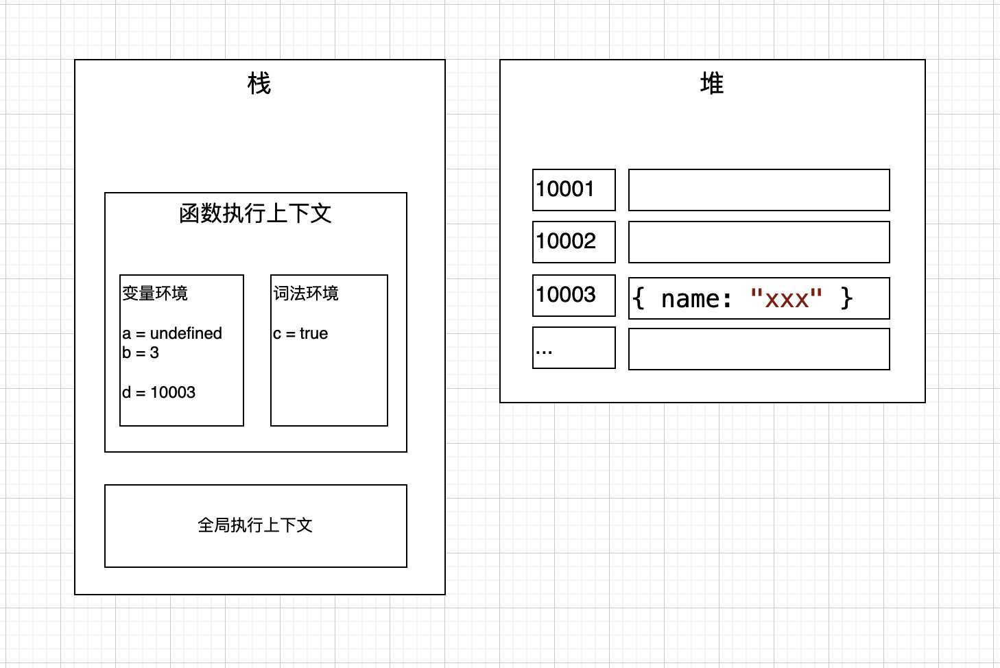

# JavaScript 的内存管理

JavaScript 是一个弱类型的、动态语言，在执行一段 JS 代码时，需要经历编译、执行、内存回收阶段。

# 一、编译阶段

<center></center>

JS 代码执行时，会首先创建`全局执行上下文`、以及`函数执行上下文`，上下文的执行顺序按照栈的方式进行调用，所以也叫做`函数调用栈`。

创建上下文时，会执行编译阶段，这一阶段会确定`作用域`，作用域确定了上下文有权限、且按一定的顺序访问的变量、函数。

进入一个上下文时，会经历`变量环境`的创建、初始化、赋值，这就导致了常见的变量提升问题。若是`ES6`环境时，还会额外多出词法环境，用于存储`ES6`的声明。

# 二、栈、堆

执行上下文存储于栈，引用对象存储于堆。

当遇见引用对象时，栈中存储的是对象在堆中的地址。所以会有这么一个现象：当将对象复制给一个变量时，修改另一个对象时，原对象的值也会发生变化。示例：

```js
var a = { name: "xxx" };
var b = a;
b.name = "yyy";

console.info(a); // {name: 'yyy'}
```

# 三、内存

JS 的内存分配是动态，不需要事先申请，同时内存也是自动释放、不需要手动释放。

`栈`占用的内存会随着上下文的执行结束而释放，`堆`占用的内存使用另一套机制。

V8 将`堆空间`分为两个区域:

- `新生代`。存放生存`时间短`的对象；空间小，一般`1～8M`。
- `老生代`。存放生存`时间久`的对象；空间大。

通用的垃圾回收流程：

1. 标记活动对象和非活动对象
2. 清理非活动对象占据的内存
3. 内存整理

## 3.1 新生代垃圾回收策略

采用 `Scavenge 算法`，基本原理：

- 将空间对半分为对象区域和空闲区域
- 当对象区域快满时，执行一次清理过程
- 为对象区域的垃圾做标记，将存活的对象有序地、复制到到空闲区域，然后清空对象区域
- 对象区域、空闲区域角色反转，等待下一次清理流程

备注：当经过两次垃圾回收依然还存活的对象，会被移动到老生代区域，即`对象晋升策略`。

## 3.2 老生代垃圾回收策略

### A. 策略

依然采用标记清除策略，标记存活对象，清除垃圾。

与新生代回收策略不同的是，不会分两个区域（对象区域、空闲区域）。所以，当清理垃圾后，存储空间不是连续的，需要执行`整理`过程。

### B. 影响

垃圾回收器的执行是占用`主线程`的，即会阻塞`JavaScript`的执行，当垃圾回收执行结束，再恢复脚本执行。这种行为叫做`全停顿（stop-the-world）`。

### C. 优化

为了降低老生代的垃圾回收而造成的卡顿，V8 将标记过程分为一个个的子标记过程，同时让垃圾回收标记和 JavaScript 应用逻辑交替进行，直到标记阶段完成，我们把这个算法称为`增量标记（Incremental Marking）算法`。
