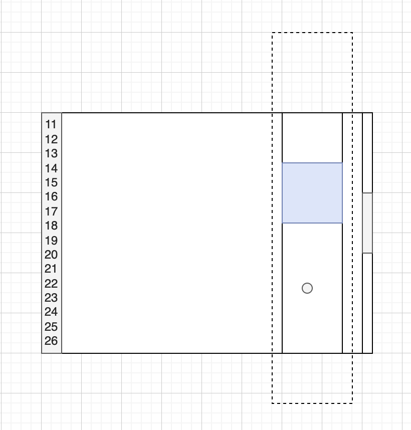
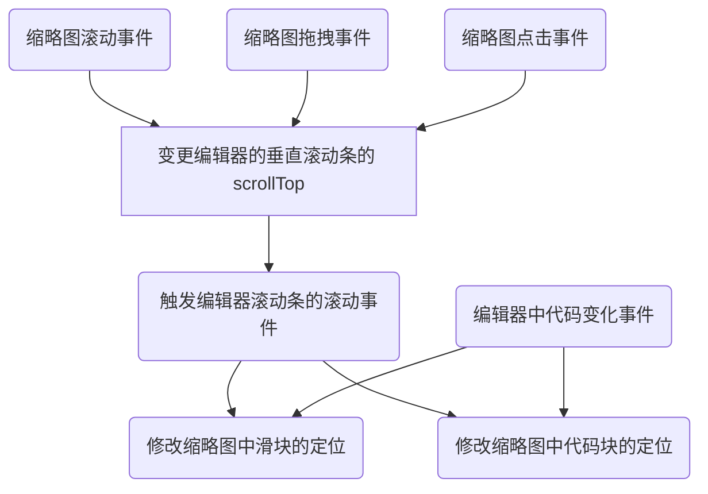

# 编辑器的缩略图实现原理

# 一、背景

部分 Web 版的 IDE 编辑器未曾实现缩略图功能，探寻一下缩略图的实现逻辑。以 VSCode 为例。

VSCode 的编辑器是`monaco`实现的，编辑器的编辑区都是采用的`虚拟渲染`，即仅渲染可视区的代码，可视区之外的动态去除 DOM 节点。

> 打开 VScode > Help > Toggle Developer Tools，观察 DOM 节点的状态变化，可以看到是在动态变化。

# 二、功能特性

参照 VSCode 的缩略图的能力，功能包括：

1. 滚动。缩略图与编辑器的滚动同步
2. 拖拽。缩略图中的滑块拖拽功能
3. 点击。缩略图的非滑块区域，通过点击操作定位到对应的代码位置

其它的特性：

1. 代码量多的场景下，缩略图中展示的是全量代码中的部分
2. 代码量多的场景下，滚动时，缩略图中的代码与滑块是同时在滚动的

# 三、方案设计

<b>假设:</b>

- 编辑器的屏高为 1，缩略图中展示的最大代码量为 N 屏的代码，代码总量为 M。
- 能够拿到编辑器的全量代码

整体设计：

## （一） 滚动同步问题

主要处理两个场景：

- 编辑器滚动事件
- 缩略图滚动事件

### 1.1 编辑器滚动事件

当编辑器滚动时，变更缩略图中代码块偏移位置，以及滑块位置。

具体的，缩略图中的代码块、滑块偏移距离，使用编辑器的滚动百分比进行计算。

核心思路：缩略图中滑块移动的百分比 = 缩略图中代码移动的百分比 = Ace Editor 垂直滚动条移动的百分比

### 1.2 缩略图滚动事件

为缩略图注册`wheel`事件，当触发事件时，动态变更编辑器的滚动位置即可

## （二）缩略图点击事件

当在缩略图中触发点击事件时，假设鼠标点击位置到滑块左上角的垂直距离 为 Dy

$$
Dy = 滑块的相对偏移高度 + \frac{滑块的相对偏移高度}{滑块可偏移高度} \times 缩略图中代码块可偏移高度
$$

从上述的公式中，可以计算出`滑块的相对偏移高度`，然后即可得出滚动的百分比。

因为，编辑器的滚动百分比 = 缩略图滑块偏移百分比 = 缩略图代码块偏移百分比，此时设置编辑器的滚动高度即可。

# 四、方案优化

此时缩略中的实现是基于全量代码，渲染所有的代码，通过移动缩略图中的代码实现。

可以将代码块这部分修改为动态渲染，知道了滚动百分比，即可计算出需要渲染的开始行。在知道行高的情况下，计算出结束行。进而实现动态渲染。

# 五、引用

- [^1] <a href="https://ace.c9.io/">https://ace.c9.io/</a>
- [^2] <a href="https://github.com/ajaxorg/ace/wiki/Configuring-Ace">https://github.com/ajaxorg/ace/wiki/Configuring-Ace</a>
- [^3] <a href="https://marvinsblog.net/post/2022-04-16-web-minimap/">https://marvinsblog.net/post/2022-04-16-web-minimap/</a>
- [^4] <a href="https://larsjung.de/pagemap/">https://larsjung.de/pagemap/</a>
