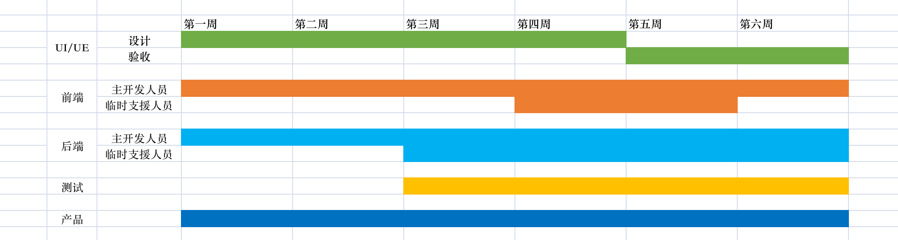

# 一次特殊的开发过程

当一个项目，备受领导重视，要啥给啥时，你是否很高兴呢？

当一个项目，开发、测试、上线周期仅有一个月的时间时，你是否高兴呢？

当一个项目，主开发人员均为临时支援人员的时候，你是否有点慌呢？

当一个项目，仅有一两位知道大部分产品设计时，你是否确实慌了呢？

当一个项目的参与人员达到八十人时，你是否压力倍增呢？

当上面的假设均为真，汇聚在一个项目中时，做我负责人的你，是否心底颤抖呢？反正我是挺慌的，甚至觉的这是一个注定要黄的项目。

当一个项目的资源、进度、质量，复杂一个量级时，如何规划任务、进度、质量呢？

# 一、灰度上线了

如上面所述，有幸参与到一次特殊的项目开发过程，上文的所有属性均已满足，`领导重视`、`一个月上线`、`临时支援人员`、`模糊的产品`、`八十人`...

老实说，接到任务时，我是挺慌的，甚至一度认为，哪怕多给一倍的开发周期，也必定是完不成的。

但结果是好的，仅比预期的上线周期`晚了一周`，暂时达到了`灰度上线`的目标。

# 二、畸形的项目

整个项目的参与人员分为数个工种：项目、产品、UI/UE、前端、后台、测试

整个项目的`参与人员`一度达到了八十人左右，为什么说是`一度`?因为人员是一批一批的加入的，并不是在项目开工之出就一次性投入的。

此次项目的特殊点：

- 此次项目没有启动大会，准确的说，没有针对涉及所有人员的启动大会。
- 此次项目没有需求，准确的说，开发人员不知道需求。
- 此次项目没有范围，准确的说，开发人员不知道功能范围边界在哪里。

所以问题来了，如何保证项目质量的？

> 答案是，测试人员。在此次项目中，测试人员可以被看做是`需求提出者`与`功能验收者`的集合体。从测试人员介入测试开始，到第一次灰度上线，这之间，产生了三千多的 BUG 单，恐怖如斯～\_～

# 三、人员流动

从 gantt 图中可以看到，其中一位很重要的角色，`产品`
