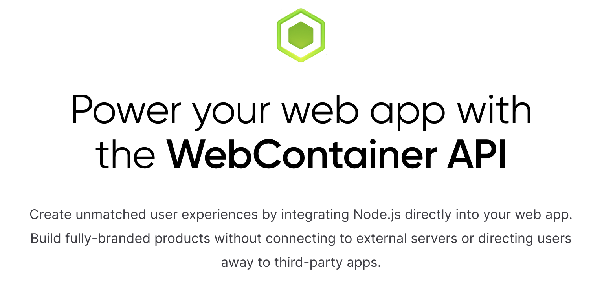

工作以来，许久未曾见过如此壮观的火烧云景观了。

# 文章

1、[穿透的 DIV （pointer-events）](https://www.oxxostudio.tw/articles/201409/pointer-events.html)1

pointer-events 是一个蛮有趣的 CSS3 属性，虽然主要是针对 SVG ，但其中几个属性应用在 div 上也是颇有意思。

顾名思义，这是一个针对滑鼠事件的属性，预设值为 auto，若值为 none，则可以穿越该元素，点击到下方的元素。

除了 auto 和 none，这是完整的属性列表：pointer-events: auto | none | visiblePainted | visibleFill | visibleStroke | visible | painted | fill | stroke | all | inherit，除了 auto 与 none，其他都是控制 SVG 的属性，若採用预设值，则 SVG 就是以 visiblePainted 来表现。

2、[pjchender.dev](https://pjchender.dev/)2

个人博客站点，包含前后端的知识点。

3、[Chrome Memory Tab: Learn to Find JavaScript Memory Leaks](https://www.bitdegree.org/learn/chrome-memory-tab)3

浏览器端同样存在内存泄露的场景，这是性能稳定性相关的内容，需要去了解：

- 如何发现内存泄露
- 如何定位内存泄露
- 如何解决内存泄露

# 工具

1、[Markdoc](https://markdoc.dev/)4

一个强大、灵活、基于 Markdown 的创作框架。

Markdoc 是一个基于 Markdown 的语法和工具链，用于创建自定义文档网站和体验。

我们设计 Markdoc 是为了支持 Stripe 的公共文档，这是我们最大、最复杂的内容网站。

2、[viz-js](https://viz-js.com/)5

适用于各种框架的 JavaScript 库，将图形图渲染为 SVG 元素，以在网页中显示它。

3、[pkg-size.dev](https://pkg-size.dev/)6

无需本地安装，在线检测 npm 包的大小。

4、[webcontainers.io](https://webcontainers.io/)7

通过将 Node.js 直接集成到您的 web 应用程序中，创造无与伦比的用户体验。

这项技术在 StackBlitz 中的在线 IDE 中可以体验到，其性能可以碾压同类的 web IDE。优势：

1. 比你的本地环境更快。构建完成的速度比 yarn/npm 快 20%，软件包安装完成的速度比 yarn/npm 快 5 倍以上。
2. 浏览器中的 Node.js 调试。与 Chrome DevTools 的无缝集成实现了本地后端调试，不需要安装或扩展。
3. 默认情况下是安全的。所有代码的执行都发生在浏览器的安全沙盒内，而不是在远程虚拟机或本地二进制文件上。

5、[Why Turbopack?](https://turbo.build/pack/docs/why-turbopack)8

turbopack 是使用 rust 编写的构建工具，这篇文档将其与 vite、webpack 进行对比。

# 图片

1、[iradesign.io](https://iradesign.io/gallery/illustrations)9

商业风格的图标站点，支持下载 PNG、SVG 类型。

2、[cleanpng.com](https://www.cleanpng.com/)10

提供透明背景的图标。

# References

- [1] 穿透的 DIV （pointer-events） https://www.oxxostudio.tw/articles/201409/pointer-events.html
- [2] pjchender.dev https://pjchender.dev/
- [3] Chrome Memory Tab: Learn to Find JavaScript Memory Leaks https://www.bitdegree.org/learn/chrome-memory-tab
- [4] Markdoc https://markdoc.dev/
- [5] viz-js https://viz-js.com/
- [6] pkg-size.dev https://pkg-size.dev/
- [7] webcontainers.io https://webcontainers.io/
- [8] Why Turbopack? https://turbo.build/pack/docs/why-turbopack
- [9] iradesign.io https://iradesign.io/gallery/illustrations
- [10] cleanpng.com https://www.cleanpng.com/
