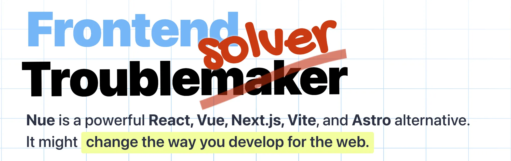
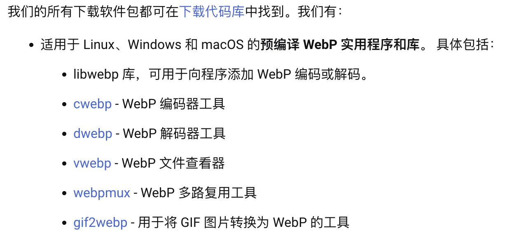

红树林公园，一棵单独生长在海岸边的树，下面一根根树立的幼苗，是从它的根茎上生长出来的。傍晚落潮后，会有一只只小螃蟹在这里浪荡。当然，也会有海鸟在这里进食。

# 文档

1. [深入了解 Commonjs 和 Es Module](https://my.oschina.net/u/5079097/blog/5171250)1

Web 开发中，引用模块时有时使用`require`、有时使用`import`，这是基于两种不同的模块规范。本文深入讲解了`CommonJS`与`ESM`之间共性与差异性。

2. [图片要启用 gzip 压缩吗？绝对不要！](http://www.webkaka.com/blog/archives/images-no-need-to-use-gzip.html)2

通常在做 Web 性能优化时，会启用 GZIP 压缩。当使用了无损压缩的 PNG 图时，压缩后的体积会比原图体积更大，做了反优化。本文讲解了为什么为发生这种现象。

3. [esno 与 tsx](https://github.com/esbuild-kit/esno)3

一直以为 esno 与 tsx 是两个东西，还有谁像我一样认知的呢？

4. [Nue JS](https://nuejs.org/docs/nuejs/)4

随着生态的发展，三大主流 Web 框架的功能特性越来越多，源码体积也越来越大。但是有时新建一个小工程时，你并不需要那么复杂的生态，可以尝试下`NueJS`（2.3 kb）。

NueJS 是一个非常小（2.3kb minzipped）的 JavaScript 库，用于构建用户界面。它是 Nue 工具集的核心。它就像 Vue.js、React.js 或 Svelte，但没有钩子、效果、道具、门户、观察者、注入、暂停或其他不寻常的抽象。学习 HTML、CSS 和 JavaScript 的基础知识，就可以开始了。

# 工具

5. [流程图](http://flowchart.js.org/)5

绘制流程图时，通常会使用阿里的 G6 等图标库，大且繁琐。当需求简单时，可以考虑换一个轻量级的库了。`flowchart.js` 压缩文件仅 70KB ，支持常规的流程图功能。

6. [时序图](https://bramp.github.io/js-sequence-diagrams/)6

一个简单的 javascript 库，用于将文本转换为矢量 UML 序列图。使用`Jison`来解析文本，使用 Snap.svg 来绘制图像。

7. [热力图 - heatmap.js](https://www.patrick-wied.at/static/heatmapjs/)7

一个有趣的 JavaScript 库，在你的站点上生产一个透明背景的热力图，展示用户在站点的操作痕迹。

8. [图片转 webp](https://developers.google.com/speed/webp/download?hl=zh-cn)8

在线的图片转`webp`的工具，质量参差不齐，何不尝试在 Chrome 推荐的本地工具呢。支持 Windows 版、Linux (aarch64)、Linux (x86-64)、macOS (arm64)、macOS (x86-64)

9. [JSDoc](https://www.jsdoc.com.cn/)9

JSDoc 3 是一个用于 JavaScript 的 API 文档生成器，类似于 Javadoc 或 phpDocumentor。可以将文档注释直接添加到源代码中。JSDoc 工具将扫描您的源代码并为您生成一个 HTML 文档网站。

10. [apidoc](https://apidocjs.com/)10

11. [表格-Luckysheet](https://dream-num.github.io/LuckysheetDocs/zh/guide/)11

Luckysheet ，一款纯前端类似 excel 的在线表格，功能强大、配置简单、完全开源。支持格式设置、单元格配置、行和列操作、图标、公式和函数等。

12. [表格-SpreadJS](https://www.grapecity.com.cn/developer/spreadjs/demo)12

商用的表格，业务场景比较复杂时，可以考虑下这家的表格组件。

13. [Web 页面截图](https://github.com/qq15725/modern-screenshot)13

使用 HTML5 或者 SVG 快速将页面 DOM 节点转化为图片.

14. [Web 页面截图之 dom-to-image](https://github.com/tsayen/dom-to-image)14

`dom-to-image` 是一个库，可以将任意 dom 节点转换为用 JavaScript 编写的矢量（SVG）或光栅（PNG 或 JPEG）图像。

# References

- [^1] 深入了解 Commonjs 和 Es Module https://my.oschina.net/u/5079097/blog/5171250
- [^2] 图片要启用 gzip 压缩吗？绝对不要！ http://www.webkaka.com/blog/archives/images-no-need-to-use-gzip.html
- [^3] esno 与 tsx https://github.com/esbuild-kit/esno
- [^4] Nue JS https://nuejs.org/docs/nuejs/
- [^5] 流程图 http://flowchart.js.org/
- [^6] 时序图 https://bramp.github.io/js-sequence-diagrams/
- [^7] 热力图 - heatmap.js https://www.patrick-wied.at/static/heatmapjs/
- [^8] 图片转 webp https://developers.google.com/speed/webp/download?hl=zh-cn
- [^9] JSDOc https://www.jsdoc.com.cn/
- [^10] apidoc https://apidocjs.com/
- [^11] 表格-Luckysheet https://dream-num.github.io/LuckysheetDocs/zh/guide/
- [^12] 表格-SpreadJS https://www.grapecity.com.cn/developer/spreadjs/demo
- [^13] Web 页面截图 https://github.com/qq15725/modern-screenshot
- [^14] Web 页面截图之 dom-to-image https://github.com/tsayen/dom-to-image

# 往期回顾

- [双周回顾#001 - 火烧云](./../001/readme.md)
