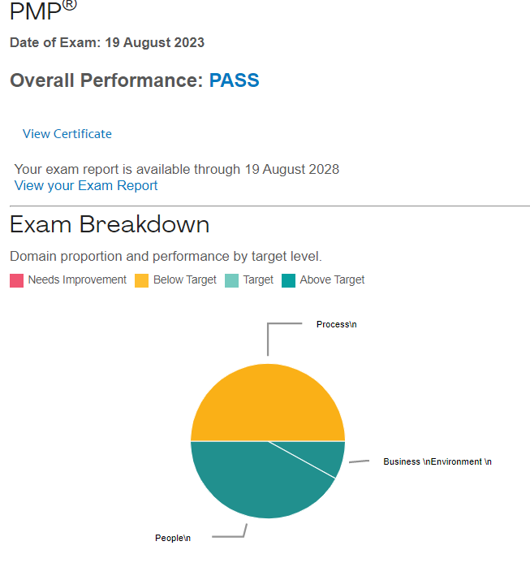
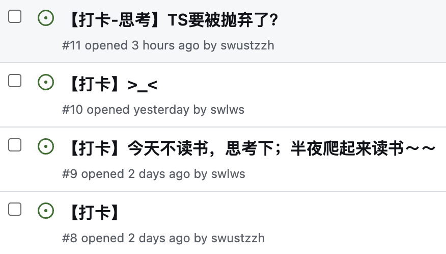
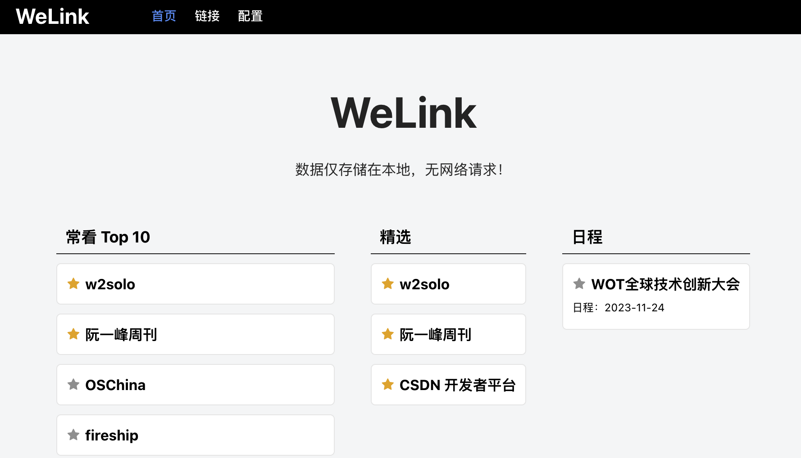

10 月 9 日，一个小生命悄悄来到世间，老家的朋友做了爸爸妈妈。

看着昔日的朋友们结婚生子，顿感不知不觉间自己也在慢慢变老。

# 一、价值

## （1）通过 PMP 认证考试

本周一个好消息，通过了 PMP 认证考试。

PMP 的得分为三个方面，过程、人、商业环境，个人得分分别为 BAA。

也就说在过程这一方面的得分低于及格线，过程模块得分低：

- 主观因素：刷题量不达标，导致得分低；
- 客观因素：个人成长环境影响吧，早期在小公司，对于过程的实践不是太看重，主要看重快速迭代的敏捷流程，结果导向。

目前供职的公司，主打一个流程正确。

常听的一句话，“不要私下搞事情，等产品建需求”，有了需求才能统计工作量，否则白做功。

虽然过程繁琐，但确保了整个过程中每个节点可追溯，避免因个人素导致线上故障。

**思考：**

- 影响。更熟悉项目管理流程，在标准化流程下做事，减少不规范操作导致的异常。
- 收益。短期来看这个证书没啥用处，长期收益目前也不确定

## （2）三十人的公司内部分享

大数据平台首页性能优化，上周正式上线。回顾总结了整个处理过程，然后在本周的大周会上进行了分享。

第一次在如此多人前做分享，紧张是难免的。所以，文档一直改了又改，唯恐有所差错。

在真正分享的过程中时，中间无人打断，于是慢慢地忘记了紧张，按照自己的思路讲解，最终的舞台表现力感觉还不错，哈哈哈哈～～

**思考：**

- 演讲时，语速放慢，不要着急，越急越容易吐字不清晰。
- 知其然，知其所以然。性能优化手段最终都会落地到最基本的技能上，网络请求、文件大小、加载、渲染...在做优化操作时需要知道性能指标及其含义，以及对应的优化手段。理论与技巧相结合，更加得心应手。
- 有时，并不要优化。不要盲目优化，当性能指标在合理范围时，不必做任何优化。防止镀金行为，此时可以去做更有价值的事情。

## （3）纵向与横向思维

分享会后，与一位架构师闲聊。他提到此次的分享在纵向的深度上很深入，他也学习到了。美中不足的是，横向的对比有所不足，比如涉及到打包的分享中，dll 、 webpack splitChunks、webpackChunkName 之间的差异及优先级问题并未说明了。

**思考：**

- 同一类的东西，了解一些横向的指标，比如：通性、差异、优先级等。强化横向意识

## （4）更高的视野/个人喜好

需求评审时，就待办列表中的一项待办。

技术负责人看后觉得没有价值，可以不做。

组员也觉得没价值，可以放弃。

产品提出，这个待办是 XX 总提出的。

技术负责人、组员沉默一会后，嗯，要做。

**思考：**

- Leader 可能存在更高的视角，看到了更多的东西。
- Leader 的个人喜好被下属的盲目跟随。

## （5）读书

读书明智，知其然，知其所以然。

前段时间在看一本书，书不厚实，断断续续的偶尔看一点，未能持续看完。

上周末，与朋友闲聊，兴之所至，搞了个【读书打卡】，算是互相监督，每日持续读上一两页书。

不想看书，看到朋友在读书。麻溜地爬起看书、打卡，一气呵成。害，这该死的胜负欲，哈哈哈哈哈

**思考：**

- 不盲目读书，应该读什么书？或者说，有价值的书？

# 二、晋升

之前未曾在大厂工作过，脑海中也不曾有过晋升的概念，关于在前端之道的晋升也没有清晰的认知。

身边有着一位优秀的 GDE 朋友，每次看他的文章都是对自己的一次激励。重新阅读了下他发表的《经过半年的努力，我终于成为了谷歌开发者专家（GDE）》文章，小有体会。

> 分享、输出、推广

- 分享。分享源自有所分享，关注所在领域的技术，深度有所得、广度有所获，然后分享他人
- 输出。体系化地整理知识，有自己的思考，在已有的知识上产出新的事物。
- 推广。以自身所思所想影响他人，与同道之人共同探索。

前段时间为 Ace Editor 编写了一个插架，为其补充了缩略图的功能。技术侧的 leader 曾给建议让我提交 PR 到开源仓库，提升个人开源影响力。一直捣鼓其它事情，没整这事儿。害，没领会真意。

**抛出问题：**

前端目前是一个细分状态。业务上可以分为内容管理、工具、图形等；技术上分为 Web 端、移动端、跨端、跨平台。

1. 前端的深度在哪里？或者说个人在前端上的深度在哪里？
2. 前端的广度在哪里？跨度如此之大，如何选择扩展的方向？

> 翻了下 GDG 近两年在社区说的分享，仅两场 Web 的分享，大部分是关于 flutter 的分享，亲.真.儿子！！！所以，横向扩展 flutter？

可能当想明白这些问题后，晋升就是水到渠成了吧。

# 文档

#### 1. [“根本不需要 TypeScript，JS + JSDoc 够了”，大佬说我想多了](https://my.oschina.net/u/6852546/blog/10114672)1

今年以来很多框架开发者都在放弃使用 TypeScript，为什么会出现这种状态呢？此文对此做出一些推论。

# 工具

#### 2. [WeLink](https://swlws.github.io/WeLink/)2

一个在线的标签管理工具，数据仅在本地存储。

# References

- [^1] 读书 https://github.com/swustzzh/coder_books/discussions
- [^2] 根本不需要 TypeScript，JS + JSDoc 够了，大佬说我想多了 https://my.oschina.net/u/6852546/blog/10114672
- [^3] WeLink https://swlws.github.io/WeLink/

# 往期回顾

- [双周回顾#002 - 红树林](./../002/readme.md)
- [双周回顾#001 - 火烧云](./../001/readme.md)
