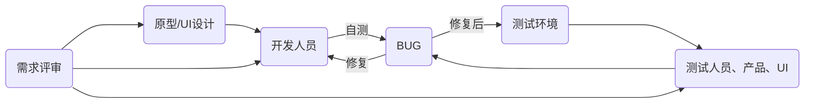
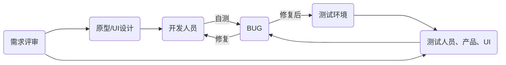
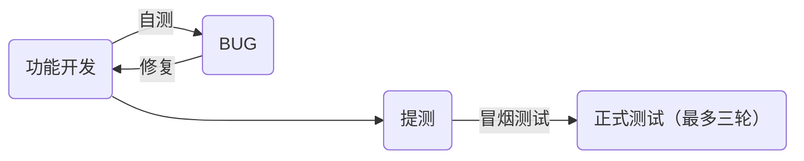
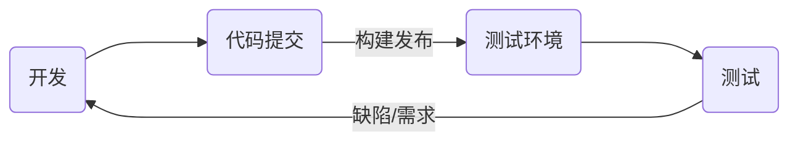

# 双周回顾#006 - 这三个月

## 断更啦~~

上次更新时间 2023/11/23, 断更近三个月的时间。

先狡辩下，因为忙、着实忙。因为忙，心安理得给断更找了个借口，批评下自己~~

这三个月在做啥？跨部门援助，支援公司互联网的 ToC 项目，一言难尽。

先说下考勤，基本上每天晚上十一点后下班。正常的双休没了，变成单休，甚至上十三天休一天。

|月份|调休时长|
|---|---|
|2023/11|76|
|2023/12|60|
|2024/01|46|

所以，确实是有点忙~~

## 一次不指望开发人员懂业务的项目开发经历

此次支援的项目属于公司重点高项，团队阵容堪称豪华，所有资源优先投入此次项目。

此次项目的最大特点就是要在`两个月内出成果，时效卡的死死的`。

但是，问题来了，大部分人是从外部门支援来的，整个团队懂业务的就那么几个人。所以遭遇了工作以来，堪称魔幻的一次开发经历。

正常的项目迭代流程：

这次就牛逼了，主打一个`开发不需要懂业务`，按图索骥就行，妥妥的牛马。

所以，效果也很显著，整个开发周期内，前后端的BUG数量，高达`6000+`。身上不带百八十个BUG，午饭都不好意思加个鸡腿~~

但是，咱就说但是。但是，项目结果也是喜人的，经过牛马们没日没夜的辛勤劳作、经过测试人员的`N轮测试`，项目成功落地。

### 项目开发

项目启动会议后，迅速再拉了一次30+人的工程架构解读会议，大伙看了两天代码，立马投入开发阶段。

早期介入开发时，大家集体懵逼。时间紧、任务重，根本没有时间给开发人员讲解业务需求、甚至需求文档都没有。

项目启动后的前两周，大伙一脸懵逼的做功能。遇到不懂得业务时，最常听到是，“先等测试提BUG就行，他们懂业务”。这也造就了，测试介入后，提了`6000+`的BUG

### 项目测试

通常情况下，当开发做完完整的功能后，经历自测、提测、冒烟测试后，测试人员才会正式介入测试。

这次流程就稍稍变化了下，整个项目管控，变成了比敏捷还敏捷。边开发、边构建、边测试，而且不限次数的测试，直到问题处理结束。

最大的变化是，测试这里提出的不再是单纯的BUG，也会包含着需求在里面。也就是说，要做什么、不做什么，基本上是通过测试人员来传达的。

> 另外很重要的一点，就是测试人员介入的时间点，在开发人员开始开发后的第三周。
> 测试的步步紧跟是这次项目成功的重要因素。

### 项目的底气

拉了一群新人，在新人完全不懂业务的情况下，为什么敢玩的这么刺激？不怕翻车吗？它的底气是什么：

1. 属于旧项目重构。业务上并不是新需求，有产品人员全程跟随，不怕业务需求跑偏。
2. 庞大的测试团体。70+人的项目组，测试人员占了一半。
3. 工程架构。可插拔的构架设计，保证了业务层的模块可以随时替换，单个模块不会影响其它模块。

项目开始后，开发人员一直在发牢骚，感觉项目负责人就是在瞎搞，妥妥的即将翻车。

令人惊讶的是，虽然一直在修修补补，但这辆车成功抵达了终点。

不过这一过程中，有一说一，技术债肯定是留下了，很多场景下，为了尽快修复问题，代码都是特写的，后期 CodeReview 时，必定要修改的。

## 价值

三个月忙忙碌碌，丢了一些东西，也捡起一些东西。

- GUI专利
  - 采集用户行为，以热力图的方式可视化展示，辅助产品运营人员做决策。同事提出的想法，我加以实现，抱同事大腿，蹭个署名，哈哈哈哈哈
- 业务串讲以及CodeReview
  - 主持数次串讲以及CodeReview
- 性能分析
  - 首屏性能问题
  - 表格卡顿问题。其中比较有趣的一点，`组件降级`处理，确实是个不错的方案
- 抉择
  - 得支援部门领导得欣赏，期望我平调到支援部门；原部门期望留下，会有新项目主持。被人欣赏的感觉，还是不错的哒

## 同事离职

同一天入职的同事离职了，时间定格在2024/2/2，遥祝一帆风顺，前程似锦。
