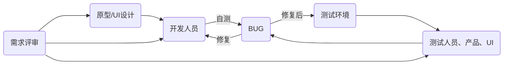
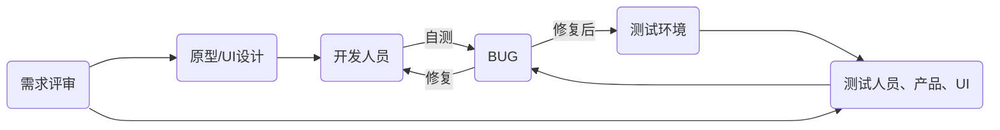

# 双周回顾#006 - 这三个月

# 断更啦~~

上次更新时间 2023/11/23, 断更近三个月的时间。

先狡辩下，因为忙、着实忙，因为忙，心安理得给断更找了个借口，批评下自己~~

这三个月在做啥？在跨部门，支援公司互联网的 ToC 项目，一言难尽。

先说下考勤，基本上每天晚上十一点后下班。正常的双休没了，变成单休，甚至上十三天休一天。

|月份|调休时长|
|---|---|
|2023/11|76|
|2023/12|60|
|2024/01|46|

## 一个不指望开发懂业务的项目

此次支援的项目属于公司重点高项，团队阵容堪称豪华，所有资源优先投入此次项目。

项目特点就是要在两个月内出成果，时效卡的死死的。

但是，问题来了，大部分人是从外部门支援来的，整个团队懂业务的就那么几个人。所以遭遇了工作以来，堪称魔幻的开发经历。

正常的项目迭代流程：

这次就牛逼了，主打一个`开发不需要懂业务`，按图索骥就行，妥妥的牛马。

所以，效果也很显著，整个开发周期内，前后端的BUG数量，高达`6000+`。身上不带百八十个BUG，午饭都不好意思加个鸡腿~~

但是，咱就说但是。但是，项目结果也是喜人的，经过牛马们没日没夜的辛勤劳作、经过测试人员的`N轮测试`，项目成功落地。

## 感悟

# 价值

- 一次月度优秀
- 一篇博客
- 一次分享
- 一次性能优化
- 一次抉择
- 一个GUI专利

# 反思

# 同事离职

同一天入职的同事离职了，时间定格在2024/2/2，遥祝一般丰顺，前程似锦
